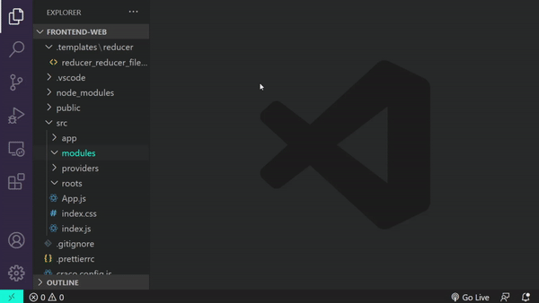
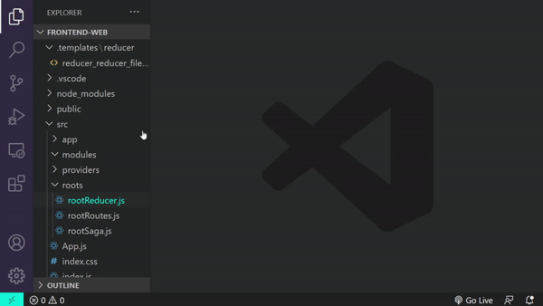
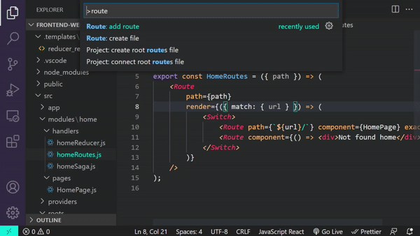
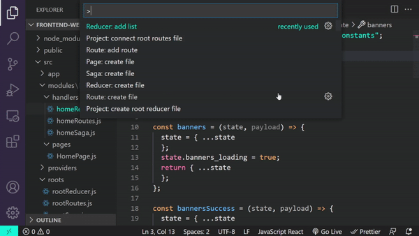
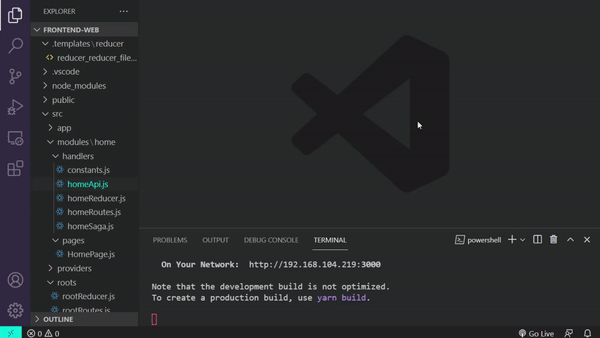
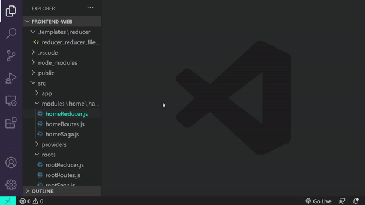
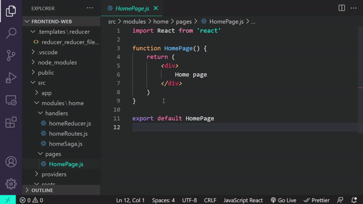
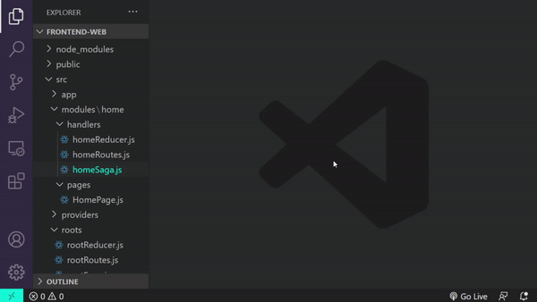
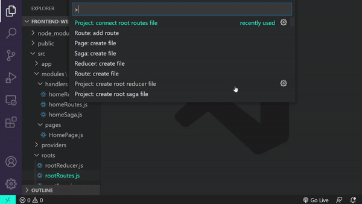
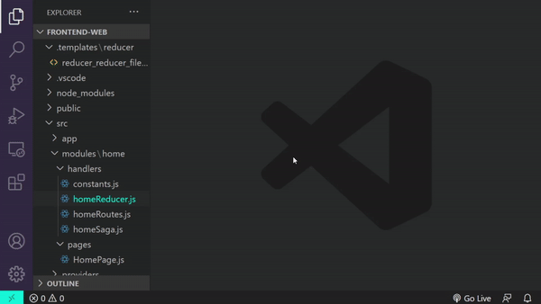

# react-redux-saga-netoya README

React Redux Saga extension for a Netoya's boilerplate.

## Requirement

### Base project

Clone the base project required for this extension

_Change ***your-project-name*** to your real project name._

```
git clone https://github.com/netoya/react-redux-saga-netoya your-project-name
```

## Features

### Roots.

- Project: create root route.
- Project: create root reducer.
- Project: create root saga.



### Modules Handles (Routes Reducer Saga).

- Reducer: create file
- Route: create file
- Saga: create file



### Connect Modules Handles (Routes Reducer Saga).

- Project: connect root routes file

  

- Project: connect root reducer file

  

- Project: connect root saga file

  

### Page.

- Page: create file

  

- Route: add route

  

### Constant.

- Constant: create file
- Constant: add constant

  

### Reducer.

- Reducer: add list

  

### Api.

- Api: create file
- Api: add function


